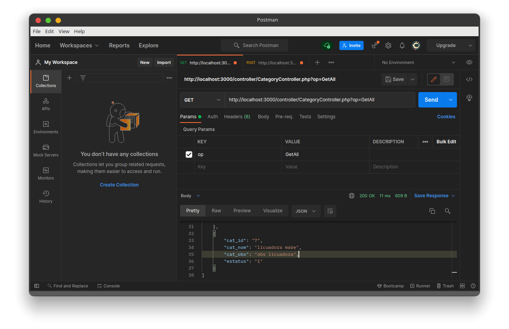

# API REST WITH PHP 

> API Rest con PHP consumido desde Postman.

## application
todos los datos a introducir son en formato JSON desde el programa Postman.
```bash
    # regresa todos los registros con estado igual a 1.
    http://localhost:YOURPORT/controller/CategoryController.php?op=GetAll

    # Regresa un registro con ID introducido.
    http://localhost:YOURPORT/controller/CategoryController.php?op=GetID

    # Inserta un nuevo registro.
    http://localhost:YOURPORT/controller/CategoryController.php?op=Insert

    # altera un registro con los atributos id, nombre y observaciones dados. 
    http://localhost:YOURPORT/controller/CategoryController.php?op=Update

    # Solo altera el registro a estado 0.
    http://localhost:YOURPORT/controller/CategoryController.php?op=Delete
```

## Screenshot

